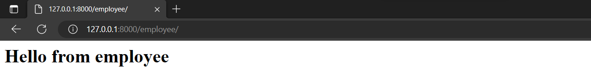

# Task 1 - Employee Management System 
**Your name here**

Develop an employee management system using Django that can store employees and their positions.

The system should have at least one current employee display page and an employee add/modify/delete page.

## Steps to Establishing the System

<small>* Here, I have only provided rough steps. You can supplement or rewrite them according to your understanding.</small>

1. Create a folder named `Employee` and open it in VSCode.
2. Create a virtual environment called `learnDjango`, by enter `python -m venv learnDjango`.
3. Select the python interpreter. Press the shortcut keys "ctrl+shift+p", search for "Python: Select Interpreter", then choose the interpreter in our created virtual environment.
4. Activate the virtual environment. Using `.\learnDjango\Scripts\Activate.ps1` in PowerShell, or `source learnDjango/bin/activate` in Linux.
5. Install Django. `pip install -i https://pypi.tuna.tsinghua.edu.cn/simple django`
6. Create your project inside the myproject folder, by using `django-admin startproject projectname .` And then run the server, to confirm everything works fine. `python manage.py runserver 8080`.
7. Create your app. `django-admin startapp employee`
8. Add a static index page for employee.
   - In views.py, add the following code snippet. 
        ```python
        from django.http import HttpResponse

        def index(request):
        return HttpResponse("<h1>Hello from employee</h1>")
        ```
   - Create a urls.py inside the employee app.
        ```python
        from django.urls import path
        from . import views

        urlpatterns = [
            path('', views.index, name='index'),
        ]
        ```
   - Include it into the main urls.py in project folder. The modified main url.py is shown below.
        ```python
        from django.contrib import admin
        from django.urls import path
        from django.urls import include

        urlpatterns = [
            path('employee/', include('employee.urls')),
            path('admin/', admin.site.urls),
        ]
        ```
   - Add 'employee' to the INSTALLED_APPS list in settings.py.
   - Run the server to confirm that the modifications are correct.
        
9. Use a template. 
   - Create 'templates' folder inside employee. 
   - Create a index.html inside the folder to show 'Hello from template'.
   - Modify views.py to use the template.
        ```python
        from django.shortcuts import render
        from django.http import HttpResponse
        from django.template import loader

        def index(request):
            template = loader.get_template('index.html')
            return HttpResponse(template.render())
        ```
   - Run the server to confirm that the modifications are correct.
10. Use an existing Bootstrap template to replace index.html.
11. Render Data to Django Template.
   - Create model for employee.
```python
from django.db import models

class Employee(models.Model):
     name = models.CharField(max_length=255)
     title = models.CharField(max_length=255)
```
   - Applying database migrations, by `python manage.py makemigrations employee` and `python manage.py migrate`.
   - Add sample data using `python manage.py shell`. Then, for example, you can add an employee using the following commands.
     * `from employee.models import Employee`
     * `emp = Employee(name=’Elon Musk’, title=’Manager’)`
     * `emp.save()`
   - Retrieve this data in view.py.
```python
from django.shortcuts import render
from django.http import HttpResponse
from django.template import loader
from .models import Employee

def index(request):
myEmployees = Employee.objects.all().values()
template = loader.get_template('index.html')
context={
     "myEmployees": myEmployees,
}
return HttpResponse(template.render(context, request))
```
   - Fetch this data in index.html.
12. Add a 'create employee' page and corresponding functionality to the employee management system (you can refer to the code).
13. Add the 'delete employee' functionality.
14. Add the 'update employee' functionality.

## Reference
[Some GitHub repo](http://github.com/)

## Problems and Solutions
if any